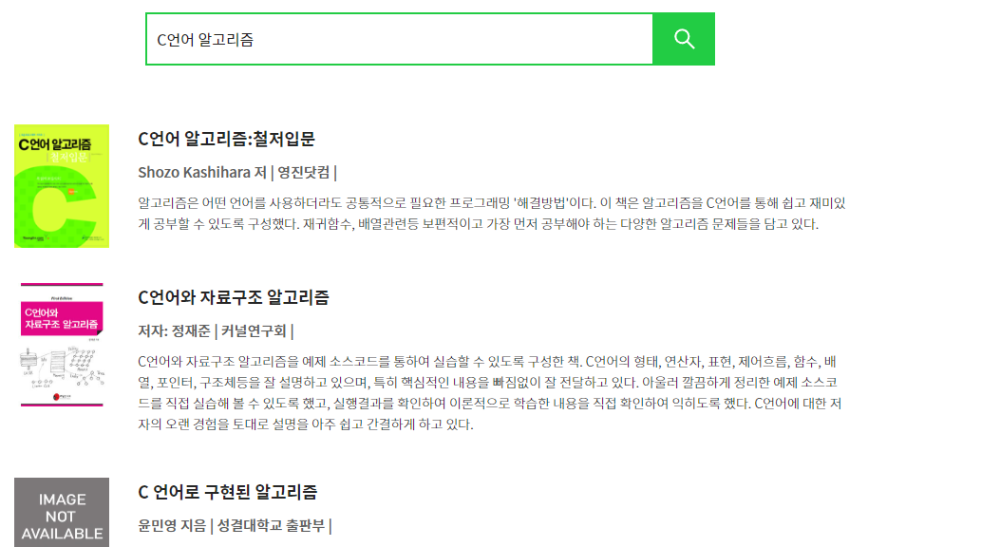
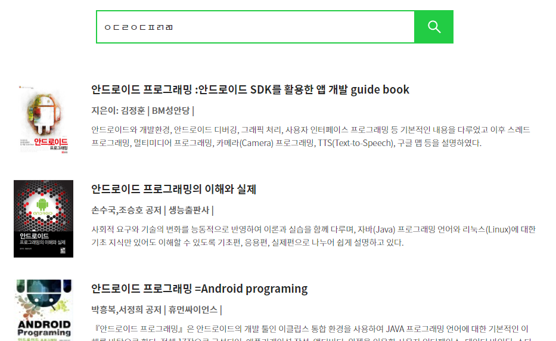
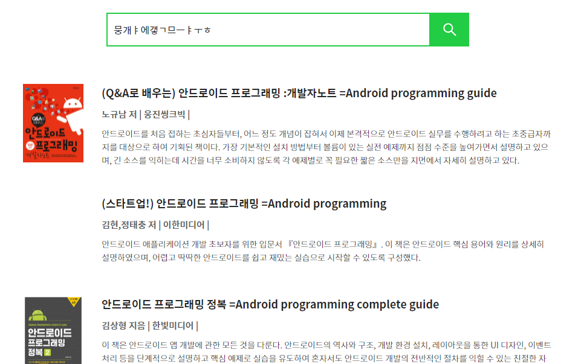
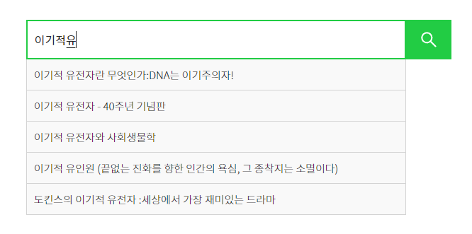
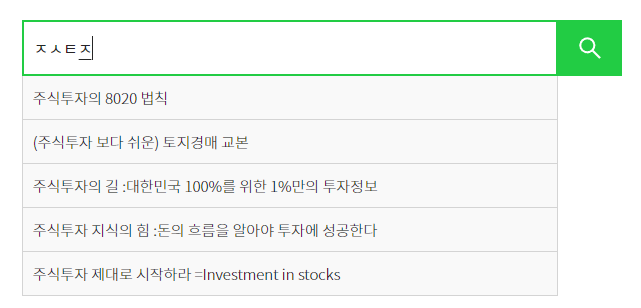
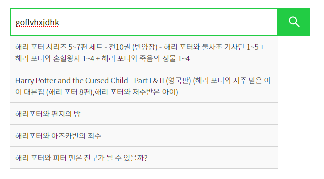
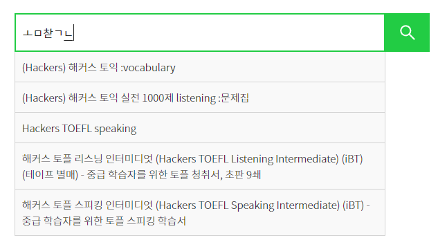

# 1. 소개

yacobooks의 api 프로젝트.

한글 검색을 위하여 엘라스틱 서치 플러그인을 자체적으로 제작하여 적용하였다. 제작안 플러그인 소스코드는 아래 깃허브 repository에서 확인 가능하다.
↓ 
[https://github.com/yaincoding/hanhinsam](https://github.com/yaincoding/hanhinsam)

<br>

**주의사항**

엘라스틱 관련 정보(host, port, id, password)는 보안상의 목적을 위해 API를 실행할 서버의 환경변수로 설정 후 런타임 시점에 읽어들이도록 설정하였다.

<br>

# 2. 기능

### 1) 검색

+ #### 일반 검색

제목, 저자명을 통한 검색. Nori analyzer 적용

ex) C언어 알고리즘 -> 'C언어', '알고리즘' 단어를 포함하는 제목을 가진 도서 검색



<br>

+ #### 초성 검색

초성을 통한 검색. ngram 필터 적용하여 띄어쓰기에 구애받지 않음

ex) ㅇㄷㄹㅇㄷㅍㄺㄻ -> 초성이 'ㅇㄷㄹㅇㄷㅍㄹㄱㄹㅁ'인 단어를 포함하는 제목을 가진 도서 검색



<br>

+ #### 영->한 전환 검색

ngram 필터 적용하여 띄어쓰기에 구애받지 않음

ex) qkfltmxk -> '바리스타' 단어를 포함하는 제목을 가진 도서 검색


<br>

+ #### 한->영 전환 검색

ngram 필터 적용하여 띄어쓰기에 구애받지 않음

ex) 뭉개ㅑ에갷ㄱ므ㅡㅑㅜㅎ-> 'androidprogramming' 단어를 포함하는 제목을 가진 도서 검색



<br>

### 2) 자동 완성

+ #### 일반 자동완성



<br>

+ #### 초성 자동완성



<br>

+ #### 영->한 전환 자동완성



<br>

+ #### 한->영 전환 자동완성



<br>

# 3. API 명세

### 1) ISBN13 으로 책 정보 조회

+ **요청**

``` http
/api/book/<isbn13>
```

<br>

+ **응답**

``` json
{
  "isbn10": null,
  "isbn13": "9788993383614",
  "title": "(Google) 안드로이드 분석과 실습 :안드로이드 OS부터 application까지 ",
  "author": "남상엽,김인기 공저",
  "publisher": "상학당",
  "pubDate": "2009",
  "imageUrl": "https://bookthumb-phinf.pstatic.net/cover/060/740/06074095.jpg?type=m1&udate=20141122",
  "description": "『안드로이드 분석과 실습』(CD1장포함)은 처음 기초 전자, 전기, 통신, 컴퓨터, 제어 및 응용을 접하는 학생에게 기본적이며 쉽고 빠르게 접근할 수 있도록 초점을 맞춘 교재이다.",
  "links": null
}
```

<br>

### 2) 책 검색

+ **요청**

``` http
/api/book/search?query=<검색어>&page=<페이지 번호>
```

<br>

+ **응답**

``` json
{
  "result": "OK",
  "totalHits": 35,
  "books": [
    {
      "isbn10": null,
      "isbn13": "9788993383614",
      "title": "(Google) 안드로이드 분석과 실습 :안드로이드 OS부터 application까지 ",
      "author": "남상엽,김인기 공저",
      "publisher": "상학당",
      "pubDate": "2009",
      "imageUrl": "https://bookthumb-phinf.pstatic.net/cover/060/740/06074095.jpg?type=m1&udate=20141122",
      "description": "『안드로이드 분석과 실습』(CD1장포함)은 처음 기초 전자, 전기, 통신, 컴퓨터, 제어 및 응용을 접하는 학생에게 기본적이며 쉽고 빠르게 접근할 수 있도록 초점을 맞춘 교재이다.",
      "links": null
    },
    {
      "isbn10": null,
      "isbn13": "9788955025385",
      "title": "자바가이드 ",
      "author": "지은이: 김현희,구현회",
      "publisher": "글로벌",
      "pubDate": "2010",
      "imageUrl": "",
      "description": "",
      "links": null
    },
    ...
  ]
}
```

<br>

### 3) 자동 완성

+ **요청**

``` http
/api/book/ac?query=<검색어>
```

<br>

+ **응답**

``` json
{
  "result": "OK",
  "titles": [
    "자바 프로그래밍:기초부터 모바일까지",
    "고급 자바 프로그래밍 =Advanced Java programming ",
    "자바 프로그래밍 =Java programming ",
    "자바 프로그래밍 실습:이클립스를 이용한 프로그래밍 해설",
    "Java 프로그래밍 실습 :자바프로그램실습 교재 ",
    "(휴대폰을 위한) 모바일 자바 프로그래밍",
    "자바 프로그래밍 기초:원리부터 응용까지",
    "자바 프로그래밍 =Java programming ",
    "(문제 해결 중심의) 자바 프로그래밍 =Java programming ",
    "자바 프로젝트 설계와 구현=Java project design & implementaion"
  ]
}
```

<br>